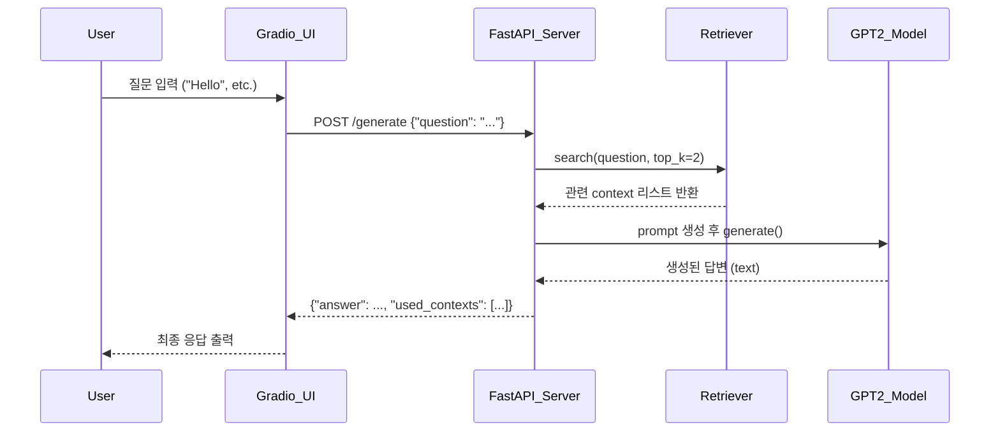

# 🧠 Perplexity RAG Search Engine

HuggingFace의 Opensource LLM모델 GPT-2와 간단한 검색기(retriever)를 결합하여 질문에 대한 답변을 생성하는 RAG(Retrieval-Augmented Generation) 기반 검색 엔진입니다. FastAPI를 백엔드로, Gradio를 통해 웹 인터페이스를 제공합니다.

## 프로젝트 구조

```bash
.
├── main.py             # FastAPI 서버 + GPT-2 답변 생성
├── search_enging.py    # 간단한 키워드 기반 Retriever
├── gradio_ui.py        # Gradio를 활용한 사용자 인터페이스
├── requirements.txt    # 필요 라이브러리 목록
└── README.md
```

## 사용 기술스텍
Python 3.10+
FastAPI – RESTful API 서버
Gradio – 웹 인터페이스 구성
Hugging Face Transformers – GPT-2 모델
Scikit-learn – 간단한 검색기 구현
Uvicorn – 비동기 서버 실행기

## 주요 기능
질문에 대해 관련된 문서를 top-k로 검색
검색된 문서들을 context로 활용해 GPT-2에게 prompt 생성
LLM 기반 자연어 생성 응답 제공
Swagger 문서 자동 생성
Gradio UI를 통해 웹에서 바로 질문/응답 가능

## 실행 방법
1. 의존성 설치
```bash
pip install -r requirements.txt
```
2. FastAPI 서버 실행
```bash
uvicorn main:app --reload
```
3. Gradio UI 실행
```bash
python gradio_ui.py
```

## 사용 예시
User:
What is quantum entanglement?

GPT-2:
Quantum entanglement enables new communication methods.

## 시퀀스 다이어그램 

## Swagger UI


## Gradio UI


라이선스

## 개선 방향

GPT-2 모델은 간단한 모델이므로 추후엔 OpenAI를 활용하거나 Llama 등의 모델을 활용 예정
현재는 document를 단순하게 만들어서 RAG를 구현, 이후에는 FAISS나 PostgreSQL + PGVector 기반 RAG로 확장 예정
Langchain 등의 라이브러리를 활용하여 RAG를 더 효율적으로 구현하고, UI를 개선 계획


