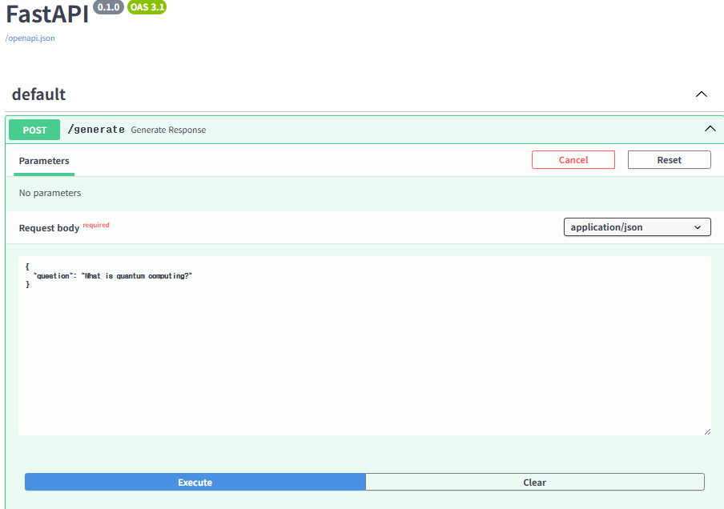

# 🧠 Perplexity RAG Search Engine

HuggingFace의 Opensource LLM모델 GPT-2와 간단한 검색기(retriever)를 결합하여 질문에 대한 답변을 생성하는 RAG(Retrieval-Augmented Generation) 기반 검색 엔진입니다. FastAPI를 백엔드로, Gradio를 통해 웹 인터페이스를 제공합니다.

## 프로젝트 구조

```bash
.
├── main.py             # FastAPI 서버 + GPT-2 답변 생성
├── search_engine.py    # 간단한 키워드 기반 Retriever
├── gradio_ui.py        # Gradio를 활용한 사용자 인터페이스
├── requirements.txt    # 필요 라이브러리 목록
└── README.md
```

## 사용 기술스텍
python 3.10+
fastAPI – RESTful API 서버
gradio – 웹 인터페이스 구성
hugging Face Transformers – GPT-2 모델
scikit-learn – 간단한 검색기 구현
uvicorn – 비동기 서버 실행기
torch

## 주요 기능
질문에 대해 관련된 문서를 top-k로 검색하여 rating합니다. 
검색된 문서들을 context로 활용해 사용자의 query와 context를 결합하여 GPT-2가 prompt 생성합니다.
LLM 기반 자연어 생성 응답을 제공합니다.
Swagger 문서를 자동 생성합니다.
Gradio UI를 통해 웹에서 바로 질문/응답 가능하도록 합니다.

## 실행 방법
1. 의존성 설치
```bash
pip install -r requirements.txt
```
2. FastAPI 서버 실행
```bash
uvicorn main:app --reload
```
3. Gradio UI 실행
```bash
python gradio_ui.py
```

## 시퀀스 다이어그램 

## Swagger UI



## Gradio UI


## 코드 결과(응집도, 결합도)

### 응집도: 모듈 내부 요소들이 하나의 목적에 얼마나 집중되어 있는지를 나타내는 척도
1.main.py: 해당 코드는 API 라우팅, 프롬프트, model의 생성기능을 한 파일에 포함하고 있어서 응집도만 고려하면 검색과 생성이 혼합되어 있어서 높지 않다고 생각합니다. 따라서 향후 generator.py와 Retriever.py로 분리할 계획입니다.

2.search_engine.py: SimpleRetriever는 검색 기능에만 집중되어 있으며, 클래스 내부에서 벡터화, 코사인 유사도 계산 등의 기능이 잘 구현되어 있으므로 응집도가 높습니다.

3.gradio_ui.py: Gradio UI 렌더링과 API 호출만 담당하므로, 응집도는 높습니다.

### 결합도: 각 파일(모듈)또는 코드가 의존하는 외부 라이브러이와의 관련성을 나타내는 척도 
1.main.py <-> search_engine.py: SimpleRetriever 객체를 직접 생성하여 사용하므로 명시적이고 간단한 연결이 가능합니다. 즉 결합도가 낮습니다.

2.main.py <-> transformers: GPT2Tokenizer와 GPT2LMHeadModel를 로딩하므로 변경 시 영향이 크므로, 결합도가 낮지 않습니다.

3.gradio_ui.py <-> main.py: API 호출 기반이므로 모듈 간 결합도가 낮고 서버 변경에도 크게 영향이 없습니다. 


## 개선 방향

1.GPT-2 모델은 간단한 모델이므로 추후엔 OpenAI를 활용하거나 Llama 등의 모델을 활용 예정입니다.

2.현재는 document를 단순하게 만들어서 RAG를 구현하였는데. Gradio에서 확인할 수 있듯이 documents양이 적기때문에 계속 동일한 답변이 반복되는 현상이 나타납니다. 향후에는 FAISS나 PostgreSQL + PGVector 기반 RAG로 확장할 예정입니다.

3.Langchain 등의 라이브러리를 활용하여 RAG를 더 효율적으로 구현하고, UI를 개선할 계획입니다.


